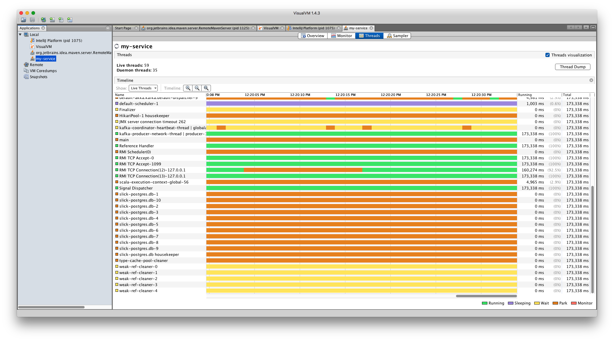

= Microservices
include::attributes.adoc[]

Welcome to the Microservices!

== Services

[horizontal]
<<authentication-management-service/authentication-management-service.adoc#authentication-management-service,Authentication Management Service>> :: Control access
<<email-service/email-service.adoc#email-service,Email Service>> :: Send email
<<loyalty-program-service/loyalty-program-service.adoc#loyalty-program-service,Loyalty Program Service>> :: Rewards program offered
<<product-management-service/product-management-service.adoc#product-management-service,Product Management Service>> :: Products
<<user-management-service/user-management-service.adoc#user-management-service,User Management Service>> :: User identities

== Data

[horizontal]
<<monitoring/monitoring.adoc#,Cassandra>> :: Cassandra
<<monitoring/monitoring.adoc#,Redis>> :: Redis
<<monitoring/monitoring.adoc#,Kafka>> :: Kafka

== Infrastructure

[horizontal]
<<kubernetes/kubernetes.adoc#,Kubernetes>> :: Containers
<<monitoring/monitoring.adoc#,Grafana>> :: Dashboard
<<monitoring/monitoring.adoc#,Prometheus>> :: AlertManager, PushGateway

== JMX

----

-Dcom.sun.management.jmxremote
-Dcom.sun.management.jmxremote.authenticate=false
-Dcom.sun.management.jmxremote.ssl=false
-Dcom.sun.management.jmxremote.local.only=false
-Dcom.sun.management.jmxremote.port=1099
-Dcom.sun.management.jmxremote.rmi.port=1099
-Djava.rmi.server.hostname=127.0.0.1

kubectl port-forward <my-pod> 1099

jconsole 127.0.0.1:1099

----

https://visualvm.github.io

=== Kafka for Mac

[source, bash, numbered, indent=0]
.Kafka Docker
----

http://wurstmeister.github.io/kafka-docker/

# Edit Kafka HOST docker.for.mac.localhost
vi docker-compose.yml

# Init Shell
./start-kafka-shell.sh  docker.for.mac.localhost docker.for.mac.localhost:2181

# Create Topic
$KAFKA_HOME/bin/kafka-topics.sh --create --topic akka --partitions 4 --zookeeper $ZK --replication-factor 1

# Producer
$KAFKA_HOME/bin/kafka-console-producer.sh --topic=akka --broker-list=`broker-list.sh`

# Consumer
$KAFKA_HOME/bin/kafka-console-consumer.sh --topic=akka --bootstrap-server=`broker-list.sh`

----